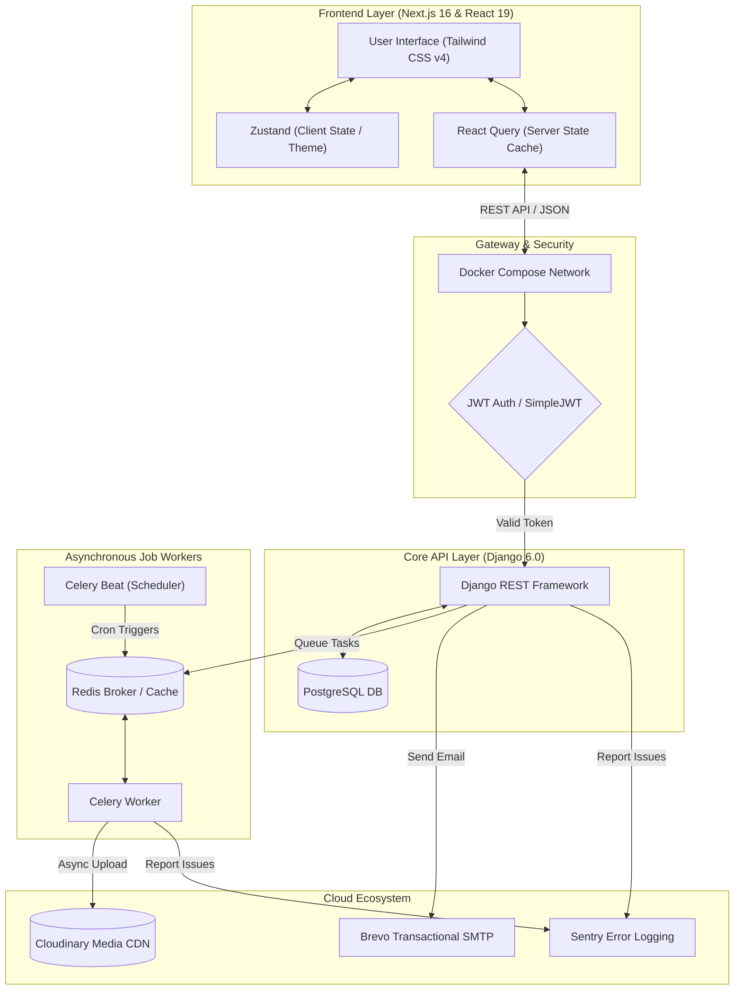

# 🛒 Modern Full-Stack E-Commerce Platform

A production-grade, highly scalable, and containerized E-Commerce application. This project showcases industry-standard engineering practices including a decoupled **Next.js 16 (React 19)** frontend, a robust **Django 6.0 REST Framework** backend, asynchronous processing with **Celery & Redis**, containerization with **Docker**, and strict code hygiene.

---

## 🎥 Video Demo & Walkthrough

Click the image below to watch a comprehensive video walkthrough of the application's user experience, design systems, and core features:

[](https://youtu.be/Q89enFNMfvI?si=T4sEm8Gjd9DqNFum)

> [!TIP]
> **[Watch the full walkthrough on YouTube](https://youtu.be/Q89enFNMfvI?si=T4sEm8Gjd9DqNFum)** to see authentication flows, variant selections, cart logic, and the administrative dashboard.

---

## 🚀 Why This Project Stands Out (For Recruiters & Engineering Managers)

Most portfolio projects are basic CRUD applications. This platform is built to emulate a **real-world, production-ready environment** by solving complex system design and data-integrity challenges:

*   **Production-Grade Architecture**: The frontend (Next.js) and backend (Django API) are completely decoupled, communicating via secure JWT protocols.
*   **Asynchronous Processing**: High-latency tasks—such as processing image uploads to Cloudinary or purging stale temp files—are offloaded to a **Celery** background worker pool with a **Redis** message broker.
*   **Database Integrity & Snapshots**: Includes advanced relational schema design, including self-referential categories (hierarchical trees) and transaction-safe order snapshotting.
*   **Modern CSS & Animation**: Styled using the newly released **Tailwind CSS v4** combined with **Lenis** for premium, silk-smooth inertial scrolling.
*   **Robust Development Operations**: Supported by containerized environments (**Docker & Docker Compose**), strong static type-checking (**Mypy**), strict formatting/linting rules (**Ruff**), and a comprehensive test suite (**Pytest**).

---

## 🛠️ Tech Stack

### Frontend
*   **Framework:** Next.js 16 (Release Candidate / React 19) — Utilizes App Router, Server Components, and client hydration.
*   **Styling:** Tailwind CSS v4 (native lightning-fast compilation, advanced CSS-first variables) & Preline UI.
*   **State Management:**
    *   **Zustand:** Client UI state, persistent theme selection, and cart cache.
    *   **TanStack React Query (v5):** Declarative server state synchronization, query caching, and auto-refetches.
*   **Form & Validation:** React Hook Form & Zod (strict schema validation).
*   **Animations:** Lenis Smooth Scroll, custom Tailwind transitions, and micro-interactions.
*   **Third-Party Integrations:** Google OAuth (`@react-oauth/google`) & Sonner Toast Notifications.

### Backend
*   **Framework:** Django 6.0 & Django REST Framework (DRF) 3.17.
*   **Database:** PostgreSQL (transaction-safe, relational index optimized).
*   **Caching & Broker:** Redis (Celery broker and database cache backends).
*   **Asynchronous Tasks:** Celery & Celery Beat (scheduled & cron tasks).
*   **Security:** SimpleJWT (Access/Refresh rotation), Argon2ID password hashing, CORS Headers, and django-allauth (MFA/social sign-in setup).
*   **Storage & CDN:** Cloudinary (Dynamic media storage and delivery optimization).
*   **Transactional Email:** Brevo via Anymail SMTP engine.
*   **Error Monitoring:** Sentry SDK integration.

### DevOps & Tooling
*   **Orchestration:** Docker & Docker Compose (Separate local and production environments).
*   **Python Package Management:** `uv` (Astral's ultra-fast package installer).
*   **Testing:** Pytest, Pytest-Django, and Factory Boy.
*   **Code Quality:** Ruff (linter/formatter) and MyPy (strict type analyzer).

---

## 📐 System Architecture

The workflow below details how client requests propagate through security layers, dynamic caches, relational databases, and background execution tasks:



---

## 💎 Advanced Engineering Deep Dives

To write code is one thing; to design scalable systems is another. Below are three code-level details highlighting architectural decisions implemented in this repository.

### 1. Relational Integrity: The Order Snapshot Pattern
**Problem:** In standard e-commerce, when a vendor changes a product's price or description, it can retroactively alter a user's past order invoices—creating legal and financial discrepancies.
**Solution:** A snapshot system in our database models. When an order is placed, we lock the current unit price and archive the selected variation configuration (e.g., color, size) in a structured JSON column (`variant_snapshot`).

*Snippet from [models.py](file:///g:/Coding/fullstack%20apps/e-commerce/e_commerce/e_commerce/store/models.py#L539-L561):*
```python
class OrderItem(models.Model):
    order = models.ForeignKey(Order, on_delete=models.PROTECT, related_name='items')
    product = models.ForeignKey(Product, on_delete=models.PROTECT, related_name='orderitems')
    variant = models.ForeignKey(ProductVariant, on_delete=models.PROTECT, related_name='orderitems', null=True)
    quantity = models.PositiveSmallIntegerField()
    
    # Snapshot fields - immutable once written
    unit_price = models.DecimalField(max_digits=10, decimal_places=2)
    variant_snapshot = models.JSONField(default=dict, blank=True) # e.g. {"Size": "L", "Color": "Blue"}
```

---

### 2. Algorithmic Optimization: Self-Referential Trees & N+1 Protection
**Problem:** E-commerce systems usually have deep category hierarchies (e.g., *Men ➔ Clothing ➔ Activewear ➔ Running Shorts*). Running recursive queries to find products under a parent category creates "N+1 query" problems, querying the database repeatedly and bringing servers to a crawl.
**Solution:** An iterative Breadth-First Search (BFS) in Python that retrieves all descendant category IDs using single-query batch filters instead of slow database recursion.

*Snippet from [models.py](file:///g:/Coding/fullstack%20apps/e-commerce/e_commerce/e_commerce/store/models.py#L141-L157):*
```python
def get_all_descendant_ids(self):
    """
    Returns IDs of all descendant categories using a single DB query loop
    (avoids recursive SQL N+1 by bulk-loading subcategories in steps).
    """
    all_ids = []
    queue = list(Category.objects.filter(parent=self).values_list('id', flat=True))
    all_ids.extend(queue)
    while queue:
        children_ids = list(Category.objects.filter(parent_id__in=queue).values_list('id', flat=True))
        all_ids.extend(children_ids)
        queue = children_ids
    return all_ids
```

---

### 3. Distributed Offloading: Resilient Cloudinary Media Worker
**Problem:** Direct uploads to cloud storage (like Cloudinary) inside a standard request-response loop block the API, causing high latency or timeouts for users uploading images.
**Solution:** The API saves image files to a local temp folder, immediately returns a `202 Accepted` status, and delegates the upload to Celery. The worker handles the network transfer, updates the database, and deletes the temp file. It also uses **Exponential Backoff** to gracefully retry failed requests.

*Snippet from [tasks.py](file:///g:/Coding/fullstack%20apps/e-commerce/e_commerce/e_commerce/store/tasks.py#L12-L66):*
```python
@shared_task(bind=True, max_retries=3)
def upload_image_to_cloudinary_task(self, app_label, model_name, object_id, field_name, temp_file_path):
    Model = apps.get_model(app_label, model_name)
    try:
        obj = Model.objects.get(pk=object_id)
        # Upload using the official Cloudinary SDK
        upload_result = cloudinary.uploader.upload(temp_file_path, folder='store/images')
        obj.image = upload_result['public_id']
        obj.upload_status = 'C' # Complete
        obj.save()
    except Exception as exc:
        obj.upload_status = 'F' # Failed
        obj.save()
        # Retry with exponential backoff on network failures
        raise self.retry(exc=exc, countdown=60 * (2 ** self.request.retries))
    finally:
        # Guarantee no storage leak on the host disk
        if os.path.exists(temp_file_path):
            os.remove(temp_file_path)
```

---

## 🛠️ Local Development Setup

You can run this project locally using Docker Compose, which spins up Next.js, Django, PostgreSQL, Redis, Celery, and Mailpit in unified containers.

### Prerequisites
*   [Docker](https://www.docker.com/products/docker-desktop/) and Docker Compose installed.
*   (Optional) [uv](https://github.com/astral-sh/uv) installed locally if running outside of Docker.

### 1. Clone & Environment Configuration
```bash
git clone https://github.com/AhnafTaiyeb310/e-commerce.git
cd e-commerce
```
Copy environment variables files:
*   **Backend:** Create `.env` within `e_commerce/` (see `e_commerce/.env.example`)
*   **Frontend:** Create `.env.local` within `frontend/` (see `frontend/.env.local`)

### 2. Run with Docker Compose
To spin up all services (Web API, NextJS Node server, Redis, Postgres, Celery, Mailpit):
```bash
# From the root directory:
docker-compose -f e_commerce/docker-compose.local.yml up --build
```
Once initialized, access these endpoints:
*   **Next.js Frontend:** `http://localhost:3000`
*   **Django REST API:** `http://localhost:8000`
*   **Mailpit (SMTP Mail Viewer):** `http://localhost:8025`
*   **Celery Flower (Worker Monitor):** `http://localhost:5555`

### 3. Database Seed & Admin Setup
Create a superuser to access the Django Administration Dashboard and seed mock products/categories:
```bash
# Execute within the running web container
docker-compose -f e_commerce/docker-compose.local.yml exec web uv run python manage.py createsuperuser
docker-compose -f e_commerce/docker-compose.local.yml exec web uv run python seed.py
```

---

## 🧪 Testing & Code Quality

This project is built with strict quality controls to ensure codebase maintainability and prevent regressions:

### 1. Test Suite (Pytest)
Run unit and integration tests with detailed coverage reporting:
```bash
# Run pytest within Django project dir
uv run pytest

# Check coverage percentage
uv run coverage run -m pytest
uv run coverage report
```

### 2. Code Linters & Type Checks
Ensuring standard code styles and type safety:
```bash
# Formatter & linter (Ruff)
uv run ruff check .
uv run ruff format .

# Static Type Checker (Mypy)
uv run mypy e_commerce
```

---

## 📧 Contact & Links
*   **Portfolio:** [Your Portfolio Website / Link]
*   **LinkedIn:** [Your LinkedIn URL]
*   **YouTube Demo Walkthrough:** [https://youtu.be/Q89enFNMfvI](https://youtu.be/Q89enFNMfvI?si=T4sEm8Gjd9DqNFum)
*   **GitHub Repository:** [https://github.com/AhnafTaiyeb310/e-commerce](https://github.com/AhnafTaiyeb310/e-commerce)
